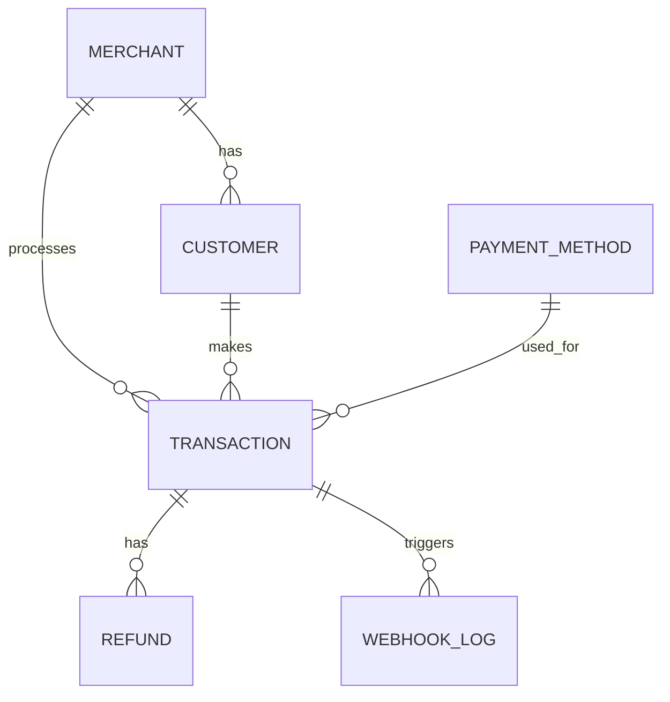

# Database Schema

## Entity Relationship

## Entities

### `User`
Used for Dashboard login.
- `id` (UUID)
- `email` (String, Unique)
- `password` (String, Hashed)
- `name` (String)
- `role` (Enum: ADMIN, MERCHANT)

### `Merchant`
- `id` (UUID)
- `name` (String)
- `code` (String, Unique)
- `apiKey` (String)
- `secretKey` (String)
- `feePercentage` (Decimal)
- `status` (Enum: active, suspended)
- `webhookUrl` (String)

### `Customer`
- `id` (UUID)
- `merchantId` (UUID, Foreign Key)
- `name` (String)
- `email` (String)
- `phone` (String)

### `PaymentMethod`
- `id` (UUID)
- `name` (String)
- `type` (Enum: credit_card, bank_transfer, e_wallet, qris)
- `additionalFee` (Decimal)

### `Transaction`
- `id` (UUID)
- `orderId` (String, Unique)
- `amount` (Decimal)
- `fee` (Decimal)
- `netAmount` (Decimal)
- `currency` (String)
- `status` (Enum: pending, processing, success, failed, expired, refunded)
- `idempotencyKey` (String)

### `Refund`
- `id` (UUID)
- `transactionId` (UUID, Foreign Key)
- `amount` (Decimal)
- `status` (Enum: pending, completed, rejected)

### `WebhookLog`
- `id` (UUID)
- `transactionId` (UUID)
- `event` (String)
- `deliveryStatus` (Enum: pending, delivered, failed)
- `statusCode` (Int)
